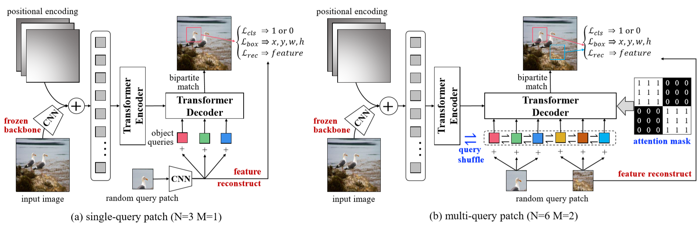

**UP-DETR**: Unsupervised Pre-training for Object Detection with Transformers
========
This is the official PyTorch implementation and models for [UP-DETR paper](https://arxiv.org/abs/2011.09094):
```
@InProceedings{Dai_2021_CVPR,
    author    = {Dai, Zhigang and Cai, Bolun and Lin, Yugeng and Chen, Junying},
    title     = {UP-DETR: Unsupervised Pre-Training for Object Detection With Transformers},
    booktitle = {Proceedings of the IEEE/CVF Conference on Computer Vision and Pattern Recognition (CVPR)},
    month     = {June},
    year      = {2021},
    pages     = {1601-1610}
}
```
In UP-DETR, we introduce a novel pretext named **random query patch detection** to pre-train transformers for object detection.
UP-DETR inherits from DETR with the same ResNet-50 backbone, same Transformer encoder, decoder and same codebase.
With unsupervised pre-training CNN, the whole UP-DETR model doesn't require any human annotations.
UP-DETR achieves **43.1 AP** on COCO with 300 epochs fine-tuning. The AP of open-source version is a little higher than paper report.



# Model Zoo
We provide pre-training UP-DETR and fine-tuning UP-DETR models on COCO, and plan to include more in future.
The evaluation metric is same to [DETR](https://github.com/facebookresearch/detr).


Here is the UP-DETR model pre-trained on **ImageNet** without labels. 
The CNN weight is initialized from [SwAV](https://github.com/facebookresearch/swav), which is fixed during the transformer **pre-training**:

<table>
  <thead>
    <tr style="text-align: right;">
      <th>name</th>
      <th>backbone</th>
      <th>epochs</th>
      <th>url</th>
      <th>size</th>
      <th>md5</th>
    </tr>
  </thead>
  <tbody>
    <tr>
      <td align="center">UP-DETR</td>
      <td align="center">R50 (SwAV)</td>
      <td align="center">60</td>
      <td align="center"><a href="https://drive.google.com/file/d/1JhL1uwNJCaxMrIUx7UzQ3CMCHqmZpCnn/view?usp=sharing">model</a>&nbsp;|&nbsp;<a href="https://drive.google.com/file/d/19BfOQzZmyOOrkdWPfpFd4HIEKaM8s5d6/view?usp=sharing">logs</a></td>
      <td align="center">164Mb</td>
      <td align="center"><tt>49f01f8b</tt></td>
    </tr>
  </tbody>
</table>

The result of UP-DETR **fine-tuned** on **COCO**:
<table>
  <thead>
    <tr style="text-align: right;">
      <th align="center">name</th>
      <th align="center">backbone (pre-train)</th>
      <th align="center">epochs</th>
      <th align="center">box AP</th>
      <th align="center">AP<sub>S</sub></th>
      <th align="center">AP<sub>M</sub></th>
      <th align="center">AP<sub>L</sub></th>
      <th align="center">url</th>
    </tr>
  </thead>
  <tbody>
    <tr>
      <td align="center">DETR</td>
      <td align="center">R50 (Supervised)</td>
      <td align="center">500</td>
      <td align="center">42.0</td>
      <td align="center">20.5</td>
      <td align="center">45.8</td>
      <td align="center">61.1</td>
      <td align="center"> - </td>
    </tr>
    <tr>
      <td align="center">DETR</td>
      <td align="center">R50 (SwAV)</td>
      <td align="center">300</td>
      <td align="center">42.1</td>
      <td align="center">19.7</td>
      <td align="center">46.3</td>
      <td align="center">60.9</td>
      <td align="center"> - </td>
    </tr>
    <tr>
      <td align="center">UP-DETR</td>
      <td align="center">R50 (SwAV)</td>
      <td align="center">300</td>
      <td align="center"><b>43.1</b></td>
      <td align="center"><b>21.6</b></td>
      <td align="center"><b>46.8</b></td>
      <td align="center"><b>62.4</b></td>
      <td align="center"> <a href="https://drive.google.com/file/d/1_YNtzKKaQbgFfd6m2ZUCO6LWpKqd7o7X/view?usp=sharing">model</a>&nbsp;|&nbsp;<a href="https://drive.google.com/file/d/1DQqveOZnMc2VaBhMzl9VilMxdeniiWXo/view?usp=sharing">logs</a> </td>
    </tr>
  </tbody>
</table>

COCO val5k evaluation results of UP-DETR can be found in this [gist](https://gist.github.com/dddzg/cd0957c5643f5656f6cdc979da4d6db1).


# Usage - Object Detection
There are no extra compiled components in UP-DETR and package dependencies are same to DETR. 
We provide instructions how to install dependencies via conda:
```
git clone tbd
conda install -c pytorch pytorch torchvision
conda install cython scipy
pip install -U 'git+https://github.com/cocodataset/cocoapi.git#subdirectory=PythonAPI'
```

UP-DETR follows two steps: **pre-training** and **fine-tuning**.
We present the model pre-trained on ImageNet and then fine-tuned on COCO.
 
## Unsupervised Pre-training
### Data Preparation
Download and extract ILSVRC2012 train dataset.

We expect the directory structure to be the following:
```
path/to/imagenet/
  n06785654/  # caterogey directory
    n06785654_16140.JPEG # images
  n04584207/  # caterogey directory
    n04584207_14322.JPEG # images
```
Images can be organized disorderly because our pre-training is unsupervised.  

### Pre-training
To pr-train UP-DETR on a single node with 8 gpus for 60 epochs, run:
```
python -m torch.distributed.launch --nproc_per_node=8 --use_env main.py \
    --lr_drop 40 \
    --epochs 60 \
    --pre_norm \
    --num_patches 10 \
    --batch_size 32 \
    --feature_recon \
    --fre_cnn \
    --imagenet_path path/to/imagenet \
    --output_dir path/to/save_model
```
As the size of pre-training images is relative small, so we can set a large batch size.

It takes about 2 hours for a epoch, so 60 epochs pre-training takes about 5 days with 8 V100 gpus.

In our further ablation experiment, we found that object query shuffle is not helpful. So, we remove it in the open-source version. 

## Fine-tuning
### Data Preparation
Download and extract [COCO 2017 dataset](https://cocodataset.org/#download) train and val dataset.

The directory structure is expected as follows:
```
path/to/coco/
  annotations/  # annotation json files
  train2017/    # train images
  val2017/      # val images
```
### Fine-tuning

To fine-tune UP-DETR with 8 gpus for 300 epochs, run:

```
python -m torch.distributed.launch --nproc_per_node=8 --use_env detr_main.py \
    --lr_drop 200 \
    --epochs 300 \
    --lr_backbone 5e-4 \
    --pre_norm \
    --coco_path path/to/coco \
    --pretrain path/to/save_model/checkpoint.pth
```
The fine-tuning cost is exactly same to DETR, which takes 28 minutes with 8 V100 gpus. So, 300 epochs training takes about 6 days.

The model can also extended to panoptic segmentation, checking more details on [DETR](https://github.com/facebookresearch/detr/blob/master/README.md#usage---segmentation).

### Evaluation
```
python detr_main.py \
    --batch_size 2 \
    --eval \
    --no_aux_loss \
    --pre_norm \
    --coco_path path/to/coco \
    --resume path/to/save_model/checkpoint.pth
```
COCO val5k evaluation results of UP-DETR can be found in this [gist](https://gist.github.com/dddzg/cd0957c5643f5656f6cdc979da4d6db1).


# Notebook

We provide a notebook in colab to get the visualization result in the paper:

* [Visualization Notebook](https://colab.research.google.com/github/dddzg/up-detr/blob/master/visualization.ipynb): This notebook shows how to perform query patch detection with the pre-training model (without any annotations fine-tuning).


# License
UP-DETR is released under the Apache 2.0 license. Please see the [LICENSE](LICENSE) file for more information.

